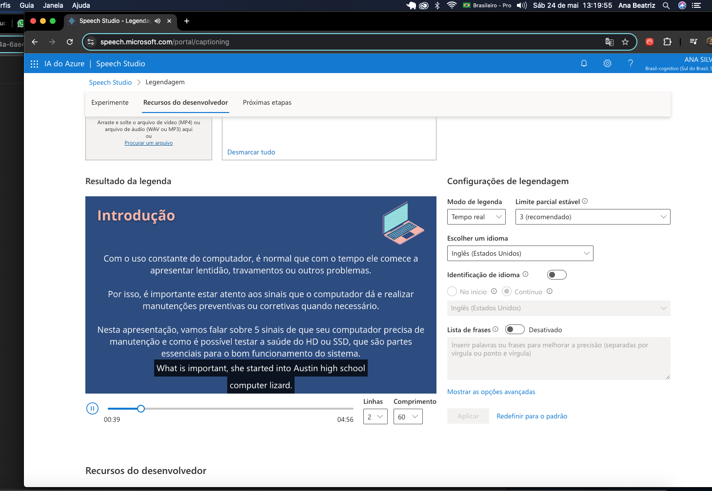
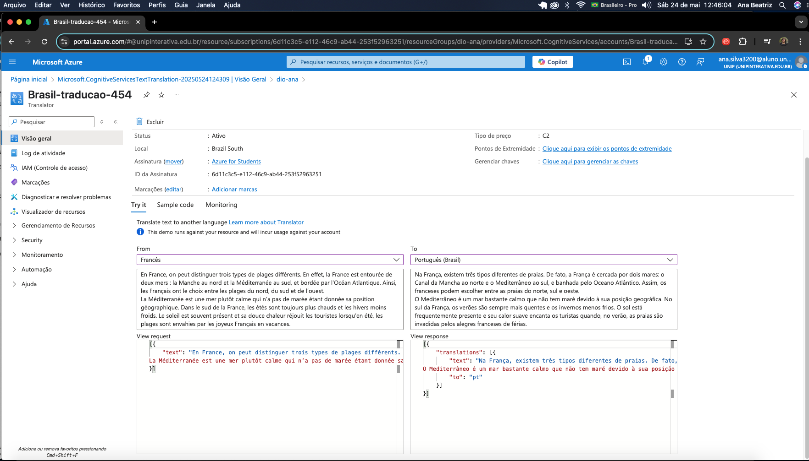

# Laboratório - Azure Speech Studio e Language Studio

Este repositório documenta minha experiência prática com ferramentas de inteligência artificial no Microsoft Azure, focadas em fala e linguagem. O laboratório faz parte do desafio proposto pela DIO, com o objetivo de explorar e aplicar os recursos oferecidos pelas plataformas **Speech Studio** e **Language Studio**.

---

## 📘 Funcionalidades Testadas

### 🎧 1. Speech to Text - Fala para Texto

Utilizei o recurso de **reconhecimento de fala** para gerar automaticamente a legenda de um vídeo.

**Etapas:**
- Acessei o [Azure Speech Studio](https://speech.microsoft.com/portal)
- Envie um vídeo com áudio em português
- O serviço transcreveu o áudio em tempo real, exibindo as legendas correspondentes

🖼️ Captura de tela:

---

### 💬 2. Conversa Interativa com IA (Fala em inglês)

Utilizei um recurso de conversação interativa com inteligência artificial, onde falei em português e o sistema respondeu em **inglês** com voz natural, utilizando IA de linguagem e fala.

**Etapas:**
- Acessei o Azure Speech Studio
- Usei um recurso de diálogo onde a IA ouvia minha fala e respondia em inglês
- A resposta foi gerada com uma voz clara, fluida e natural

Exemplo de interação:
> Eu falei: `"Oi, tudo bem?"`  
> A IA respondeu (em inglês): `"Hello! I'm doing great, thank you!"`

Esse teste demonstrou a capacidade da plataforma em **compreender a fala, traduzir e gerar uma resposta falada com fluidez**.

🖼️ Captura de tela:

---

### 🌍 3. Translator + Detecção de Idioma

Usei o serviço de **detecção de idioma com tradução automática** no Language Studio.

**Etapas:**
- Acessei o Azure Translator
- Colei um texto em francês (sem escolher o idioma)
- O serviço detectou o idioma de origem automaticamente e traduziu para português

Texto original:
> `"En France, on peut distinguer trois types de plages différents..."`  
Tradução gerada:
> `"Na França, existem três tipos diferentes de praias..."`

🖼️ Captura de tela:

---

## 📚 Aprendizado

Com este laboratório, explorei os principais recursos de IA do Azure aplicados à linguagem. As ferramentas permitem:

- **Reconhecer fala com precisão** (Speech to Text)
- **Conversa com IA** a partir de textos (Text to Speech)
- **Detectar idiomas automaticamente** e realizar traduções rápidas (Translator)

Esses recursos podem ser aplicados em sistemas acessíveis, bilíngues ou automatizados.

---

## 🛠️ Tecnologias Utilizadas

- Microsoft Azure (Speech Studio, Translator)

---

